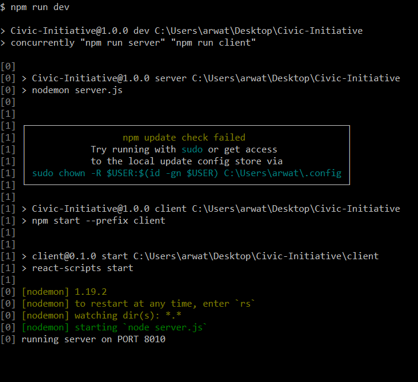
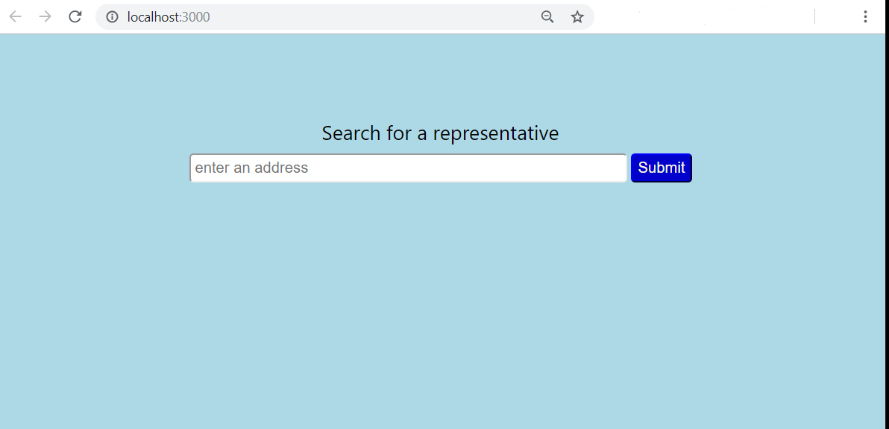

# Civic-Initiative

Look up the US representatives and learn something about them while you're at it.

## Description

The purpose of this web application is to provide a variety of resources to help people understand who their representatives are and what they do.

If you do not know the names of the people who represent you in your local government, you can search for them using your address. You will be provided with their name, title, the branch of government they are associated with, any phone numbers or addresses listed from google civic info, as well some links to various resources available about them.

Some resources may include; news articles that reference that representative, their Facebook page, their Youtube page, their official website, their local wiki page.

There are a lot of great resources out there for learning about your representative, however the Civic Initiative remains a great place to start for learning more about the people that represent you.

At the moment Google Civic Information only provides information on US representatives, which unfortunately limits the scope of this application to the US.

## Alpha testing is GO!

I have got the bare minimum application deployed.

The link to this application can be found [here](https://civic-initiative.herokuapp.com/).

I have basically set up the bare minimum features I set out to set up for this project. There are still a number of ways this application can be improved. For instance I would love to set up more links to the [Local Wiki](https://localwiki.org) project, or possibly link the representatives title to an appropriate wikipedia page.

These are just some examples of what could be small quality of life updates that could make the information more accessible to someone whose has little to no knowledge about the people that represent them in government.

If you have any questions, comments, concerns, or constructive criticism, I can be reached at my email address.

arwaterman@gmail.com

I am accepting contributions to this project, I just ask that you send me a polite message through email introducing yourself and telling about the feature you are contributing.

## Getting Started

These instructions will get you a copy of the project up and running on your local machine for development and testing purposes.

### Prerequisites

Make sure that you have the latest version of [Node.js](https://nodejs.org/en/) installed.

You'll also want to have [Git](https://git-scm.com/) installed as well, but if you're here then you probably already have it.

### Installing

This guide assumes you have some experience using a [Command Line Interface](https://en.wikipedia.org/wiki/Command-line_interface), but not everyone does.

Personally I think it's worth going through the effort of learning. With a bit of patience and practice it can be faster to perform the commands through a CLI then it is to load up an [IDE](https://en.wikipedia.org/wiki/Integrated_development_environment) and do the same actions. 

First you'll want to navigate to the directory where you want to store the project, then you'll want to clone the project.

To clone the project, try using one of the following commands,

```
// using https
git clone https://github.com/RexStrider/Civic-Initiative.git

// using ssh
git clone git@github.com:RexStrider/Civic-Initiative.git
```

Once the repository has been cloned, you'll want to set up your API keys for the project.

You are going to need API keys for the [News API](https://newsapi.org/) and the [Google Civic Information API](https://developers.google.com/civic-information/).

Instructions for retrieving an API key for these applications are given on their associated websites, so best of luck with that!

Once you have retrieved both API keys, navigate to the root directory of the project.

Create a file and name it ".env"

In the .env file, add the following text,

```
NEWS_API_KEY=your-news-api-key
GOOGLE_CIVIC_INFORMATION_KEY=your-google-civic-information-api-key
```

Make sure to **NOT** include any qoutation marks around the api keys. Qoutation marks will be interpreted as their own characters and this will cause the api call to fail.

Then, assuming that your still within the root directory of the project, install the node dependencies.

```
// install the node dependencies
npm i
// or
npm install
```

Once you've installed the node dependencies for the server, navigate to the client directory and install the node dependencies once more.

```
// change directory to the client folder
cd client

// install the node dependencies
npm i
```

After completing the steps above, navigate back to the root directory of the project and run the development environment script.

```
// navigate back to the root directory
cd ..

// run the development environment script
npm run dev
```

Shortly after running the script, you should be greated with a prompt on your command line, indicating the script has started.



A short time after the script has started, the application should load in your browser.

The application can also be viewed by navigating to http://localhost:3000



### Deployment

This project has already been deployed on Heroku.

Any changes that have been merged to the master branch should be visible in the production build in approximately 5 minutes after the merge.

You can view this production build by clicking on the following [link](https://civic-initiative.herokuapp.com/).

## Built With

 - [News API](https://newsapi.org/)
 - [Google Civic Information](https://developers.google.com/civic-information/)
 - [Node.js](https://nodejs.org/en/)
 - [React](https://reactjs.org/)
 - [Express](http://expressjs.com/)
 - [Concurrently](https://www.npmjs.com/package/concurrently)
 - [Body Parser](https://www.npmjs.com/package/body-parser)
 - [Axios](https://www.npmjs.com/package/axios)
 - [Nodemon](https://nodemon.io/)
 - [Dotenv](https://www.npmjs.com/package/dotenv)
 - [Heroku](https://www.heroku.com)

## Contributing

I will be posting guidelines for contributing to this project at a later date.

For now, all I ask is that when you're working on a new feature, create a new branch.

And when you want to merge into the master branch, send me an email introducing yourself and telling me about the feature you created.

It might take me a week to review the feature, but I will do my best to review your feature and respond to your message.

## Versioning

I'm using [Git](https://git-scm.com/) for versioning.

## Authors

 - Aaron Waterman Rose - initial work - [RexStrider](https://github.com/RexStrider)

## License

This project is licensed under the MIT License - see the [LICENSE.md](https://github.com/RexStrider/Civic-Initiative/blob/master/LICENSE.md) file for details

## Acknowledegments

I'd like to give a shout out to the [Local Wiki](https://localwiki.org) project. They have a lot of great information and links to various political representatives and I hope to incorporate more references to their project when I get the chance.